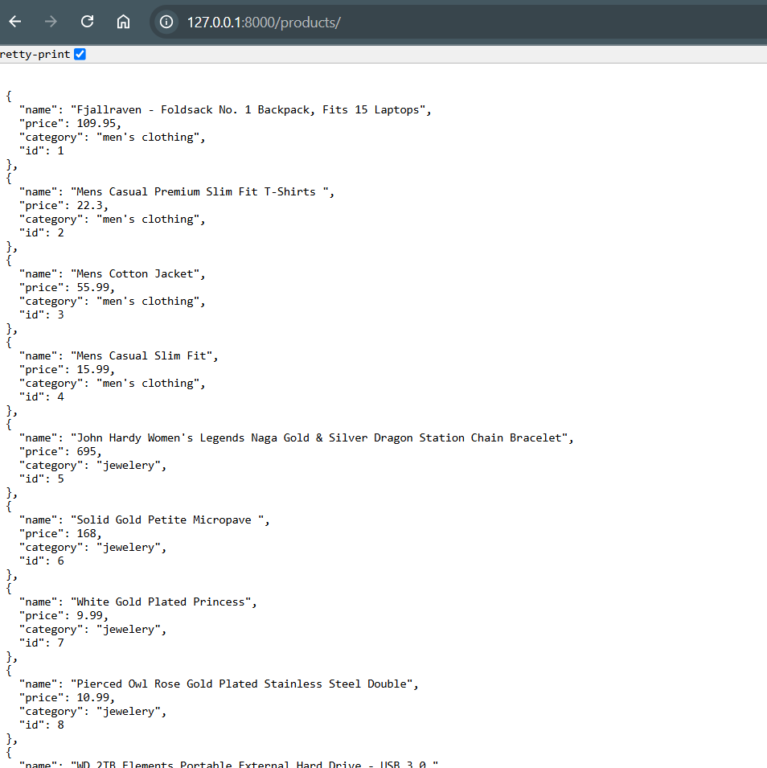
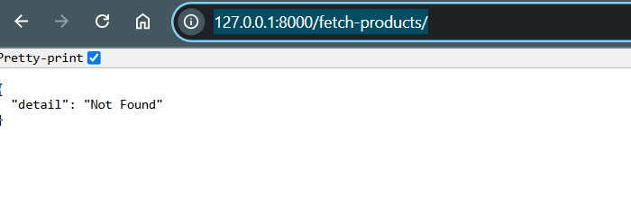
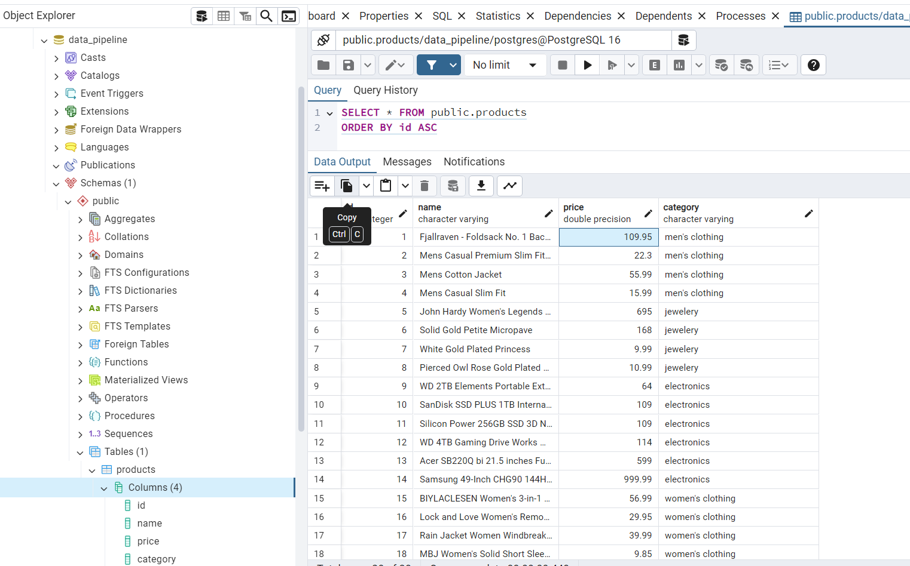

## End-end Data Pipeline - Demo

### Features
 - system fetches and shares raw data from an external API of a clothing shop

 - Visualize data on browser through Flask API endpoints

 - Containerized using Docker and CICD pipeline automated using GitHub Action\

### Tools used
- fastapi 
- sqlalchemy 
- psycopg2 
- pandas 
- requests
- alembic 
- uvicorn
- Postgresql
- PGAdmin 4

### Structure
app:
- crud
- database
- main
- models
- schemas

environment:
venv

CICD & packages:
.gitignore
Dockerfile
ReadME
requirements.txt

### Procedure
Step 1:
- Create virtual environment and activation of environment
- Installation of requirements
- main.py files inside 'app' folder
- API end points define
- Build Dockerfile and Yaml file

Step 2:
- Build Docker container:
docker build --no-cache -t data-pipeline .      

- Run Docker image :
docker run -p 8000:8000 data-pipeline

- Run via Flask:
uvicorn app.main:app --reload

Step 3:
- Automate CICD using GitHub Action

Step 4:
- Build a frontemnd using Tablaue or FET

